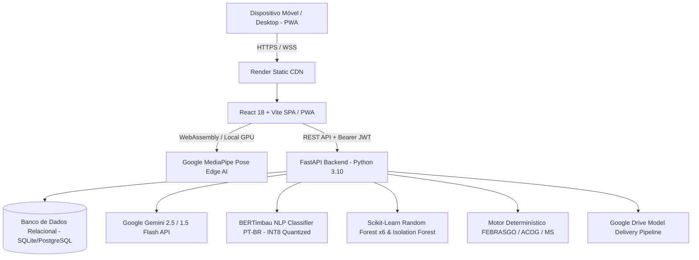

# Documentação Técnica e de Arquitetura da Plataforma Nymphia
> **Versão da Plataforma**: 2.3.0 (Produção Cloud Ready)  
> **Slogan**: *"Cada batimento importa."*  
> **Diretrizes e Protocolos Clínicos**: Ministério da Saúde do Brasil, FEBRASGO, ACOG (American College of Obstetricians and Gynecologists), CDC e Resolução CFM 2.454/2026.  
> **Repositório Oficial**: [`https://github.com/Gabrie-Pokk/Nymphia.git`](https://github.com/Gabrie-Pokk/Nymphia.git)  
> **Ambiente de Produção (Render)**: [`https://nymphia-plataforma-ia.onrender.com`](https://nymphia-plataforma-ia.onrender.com)  

---

## 1. Visão Geral e Identidade do Projeto

O **Nymphia** é uma plataforma e startup de saúde perinatal focada no acompanhamento contínuo da gestante, na prevenção ativa de desfechos adversos e na conexão em tempo real entre a gestante, seu médico obstetra e seu parceiro/rede de apoio.

A plataforma substitui anotações em papel e fragmentação de laudos por um ecossistema digital inteligente, combinando telemonitoramento de sinais vitais, avaliação postural biomecânica, triagem de sintomas de alarme e predições epidemiológicas populacionais.

### Identidade Visual e Design System (Paleta 60-30-10)
A interface foi projetada rigorosamente com base nas diretrizes **WCAG AA** de acessibilidade para gestantes em momentos de fadiga, estresse ou mobilidade reduzida:
* **60% Âncora da Marca**: Vinho Profundo (`#5C1A2A`) — cabeçalhos, títulos estruturais, cartões nobres e tipografia primária.
* **30% Ação e Direcionamento**: Rosa Materno (`#C2185B`) — botões primários de ação, badges interativos e destaque de navegação.
* **10% Acento e Sofisticação**: Dourado Suave (`#C9A84C`) — marcos gestacionais, badges de certificação e orientações especiais.
* **Superfícies de Respiro**: Rosa Claro Eutrófico (`#FDF0F2`) e Branco Puro (`#FFFFFF`) — leitura limpa sem poluição visual.
* **Uso Exclusivo de Emergência**: Vermelho Clínico (`#C0392B`) — restrito ao Botão Flutuante do SAMU 192 e sinais de contraindicação médica absoluta.
* **Tipografia**: Família *Inter / Sans-serif estrito*, com touch targets mínimos de 44x44px em todos os controles móveis.

---

## 2. Arquitetura Tecnológica e Topologia de Nuvem



### 2.1. Frontend (Cliente PWA)
* **Framework**: React 18 com Vite 5.
* **PWA & Capacidade Offline**: Service Worker ativo com manifesto (`manifest.json`) garantindo que a tela de socorro (`/emergencia`), contatos do SAMU e dados da maternidade abram instantaneamente mesmo sem sinal de internet ou rede celular.
* **Design System**: Vanilla CSS com Design Tokens (`index.css`), eliminando sobrecargas de frameworks pesados e garantindo tempo de carregamento (LCP) inferior a 1.5s.
* **Ícones**: `lucide-react`.
* **Áudio e Biomecânica**: Web Speech Synthesis API para orientações posturais sonoras sem necessidade de a gestante olhar fixamente para a tela enquanto se movimenta.

### 2.2. Backend (API REST)
* **Framework**: FastAPI (Python 3.10) de altíssimo desempenho assíncrono.
* **ORM e Persistência**: SQLAlchemy 2.0 com suporte nativo a SQLite local e PostgreSQL em produção (`psycopg2-binary` com pool de conexões).
* **Validação**: Pydantic v2 com esquemas estritos e sanitização contra injeções.
* **Segurança e Criptografia**: Autenticação stateless via Bearer JWT (HMAC-SHA256), hashing de senhas com BCrypt e proteção de dados em repouso.
* **Total de Endpoints**: **90+ rotas REST documentadas** estruturadas por módulos de domínio clínico.

---

## 3. Especificação das Inteligências Artificiais

A Nymphia opera com uma arquitetura de IA em camadas, garantindo que modelos generativos e preditivos nunca tomem decisões médicas isoladas sem a supervisão de guardrails clínicos rígidos:

| Camada | Tecnologia / Modelo | Onde Roda | Função e Métricas de Validação |
| :--- | :--- | :--- | :--- |
| **Visão Computacional & Biomecânica** | **Google MediaPipe Pose** | **Edge AI** (Navegador via WebAssembly) | Rastreia 33 marcos anatômicos tridimensionais a 30+ FPS. Avalia lordose, alinhamento espinhal, báscula pélvica e amplitude de agachamento. **Privacidade Absoluta**: Nenhum frame de vídeo é enviado para a nuvem. |
| **Acolhimento & Dúvidas Maternas** | **Google Gemini (2.5 Flash / 1.5 Flash)** | Backend Nymphia (`ai_chat_service.py`) | Assistente maternal empático com temperatura controlada (0.4) para responder dúvidas de rotina, sono, mitos e preparativos. Proibido de emitir diagnósticos. |
| **Classificação Neural de Sentimentos** | **BERTimbau Fine-Tuned (PT-BR)** | Backend Nymphia (`ai_text_service.py`) | Classificador neural de texto multi-rótulo em 6 categorias clínicas. **ROC-AUC: 0.9725** / **F1-Macro: 0.8165**. Quantizado em INT8 para rodar leve na CPU. |
| **Rastreio Epidemiológico de Risco** | **Random Forest Ensemble (x6)** | Backend Nymphia (`ai_risk_service.py`) | Modelos supervisionados calibrados com dados do SINASC e SIH (DataSUS) para 6 condições obstétricas críticas. |
| **Detecção de Atipicidade Clínica** | **Isolation Forest (Não-Supervisionado)** | Backend Nymphia (`ai_risk_service.py`) | Detecta combinações incomuns de sinais vitais e histórico multivariado que fogem aos padrões populacionais habituais. |
| **Guardrails Médicos Invioláveis** | **Motor de Regras FEBRASGO / ACOG / MS** | Backend Nymphia (`clinical_movement_service.py`) | Conjunto de regras determinísticas que sobrepõem e bloqueiam qualquer recomendação da IA caso a paciente apresente sintomas de alarme. |

---

## 4. O Modelo BERTimbau: Treinamento, Entrega e Otimização INT8

### 4.1. Dataset e Treinamento (Google Colab)
O modelo de linguagem neural da Nymphia foi construído a partir do modelo base `neuralmind/bert-base-portuguese-cased` e ajustado (*fine-tuned*) em ambiente GPU T4 com uma base curada de 434 exemplos sintéticos contextualizados na linguagem informal da gestante brasileira (`nymphia_checkins_sinteticos.csv`).

O modelo aprendeu a identificar nuances emocionais sutis e queixas sem depender de palavras-chave óbvias, dividindo os relatos em 6 classes:
1. `ansiedade` (F1: 0.7500)
2. `tristeza_desanimo` (F1: 0.8000)
3. `estresse_sobrecarga` (F1: 0.9091)
4. `medo_inseguranca` (F1: 0.8889)
5. `bem_estar` (F1: 0.8235)
6. `sintoma_fisico` (F1: 0.7273)

### 4.2. O Desafio da Nuvem e a Solução de Entrega
Como os pesos em ponto flutuante pesam ~435 MB (`model.safetensors`), mantê-los no Git violaria as boas práticas de versionamento. Para resolver isso:
* Desenvolveu-se o serviço de entrega [`model_downloader.py`](file:///C:/Users/24011517/.gemini/antigravity-ide/scratch/Nymphia/nymphia_backend/app/services/model_downloader.py).
* Na subida do contêiner no Render, o servidor verifica se os arquivos existem em disco; caso contrário, baixa os arquivos oficiais com verificação de tamanho por blocos de 4 MB diretamente do Google Drive oficial do projeto.

### 4.3. Quantização Dinâmica INT8 (`torch.quantization.quantize_dynamic`)
Em contêineres gratuitos ou básicos de nuvem (como a instância de 512 MB de RAM do Render), o carregamento de transformers em PyTorch padrão consome entre 700 MB e 900 MB, causando encerramento forçado por falta de memória (OOM).
* **Engenharia Nymphia**: Aplicou-se quantização dinâmica INT8 sobre os módulos lineares do modelo no carregamento.
* **Impacto**: O uso de memória RAM do modelo caiu de **~800 MB para apenas ~180 MB**, mantendo a acurácia de predição e permitindo que o BERTimbau rode com estabilidade total dentro da cota de 512 MB do Render.

---

## 5. Modelos Random Forest de Risco Clínico (DataSUS)

O módulo de predição populacional avalia o perfil e os sinais vitais da gestante contra seis modelos matemáticos calibrados com dados de milhões de internações obstétricas brasileiras:

1. **`rf_bem_estar_fetal.joblib`** (40.3 MB): Rastreio de sofrimento fetal, vitalidade e desfechos ao nascer.
2. **`rf_malformacao.joblib`** (27.7 MB): Rastreio estatístico de risco para anomalias congênitas baseado em histórico e idade materna.
3. **`rf_pre_eclampsia.joblib`** (5.3 MB): Rastreio probabilístico de pré-eclâmpsia a partir de perfil pressórico, histórico e paridade.
4. **`rf_diabetes_gestacional.joblib`** (3.0 MB): Predição de risco de DMG associada a ganho de peso e glicemia.
5. **`rf_eclampsia.joblib`** (2.9 MB): Risco de convulsões obstétricas e síndrome HELLP.
6. **`rf_itu.joblib`** (707 KB): Risco de infecção do trato urinário associada a trabalho de parto prematuro.
7. **`isolation_forest_anomalia.joblib`** (504 KB): Detector não supervisionado de combinações atípicas multivariadas.

---

## 6. Governança e Proteção Jurídica Visual (CFM 2.454/2026 e CDC)

Para garantir proteção ética e segurança jurídica em conformidade com o **Conselho Federal de Medicina** e o **Código de Defesa do Consumidor (CDC, Art. 6º, III e Art. 31)**:

1. **Direito de Recusa da IA (CFM 2.454/2026)**:
   * A gestante tem o direito expresso de optar por utilizar a Nymphia operando exclusivamente sob as regras clínicas do Ministério da Saúde, recusando análises automáticas por inteligência artificial.
2. **Exibição Obrigatória dos Disclaimers na Tela**:
   * O aviso de responsabilidade **não fica oculto em termos de uso ou apenas no tráfego JSON**.
   * O componente [`TriageDisclaimer.jsx`](file:///C:/Users/24011517/.gemini/antigravity-ide/scratch/Nymphia/frontend/src/components/TriageDisclaimer.jsx) é renderizado visualmente em todas as telas de cuidado diário:
     > *"Apoio de Cuidado & Bem-Estar (CFM 2.454/2026 e CDC): As análises estatísticas e orientações apresentadas constituem triagem preditiva e apoio educativo, sujeitas a margem probabilística (falsos positivos/negativos), e NÃO CONSTITUEM DIAGNÓSTICO MÉDICO nem substituem consultas presenciais e decisões clínicas do seu médico obstetra."*
   * No Prontuário Médico ([`PatientRecord.jsx`](file:///C:/Users/24011517/.gemini/antigravity-ide/scratch/Nymphia/frontend/src/pages/profissional/PatientRecord.jsx)), uma caixa de alerta jurídico-clínico é exibida imediatamente abaixo das 6 probabilidades calculadas, protegendo o médico e orientando a equipe de saúde.

---

## 7. Módulos e Funcionalidades por Perfil de Usuário

### 7.1. Perfil Gestante
* **Onboarding em 4 Etapas ([`OnboardingClinico.jsx`](file:///C:/Users/24011517/.gemini/antigravity-ide/scratch/Nymphia/frontend/src/pages/gestante/OnboardingClinico.jsx))**: Histórico obstétrico com validação de consistência, Regra de Naegele para DPP (+7 dias / +9 meses), histórico familiar e escolha da maternidade de referência com GPS e telefone.
* **Página Inicial ([`GestanteHome.jsx`](file:///C:/Users/24011517/.gemini/antigravity-ide/scratch/Nymphia/frontend/src/pages/gestante/GestanteHome.jsx))**: Idade gestacional em semanas e dias, status do check-in, cartão do próximo compromisso e atalhos rápidos.
* **Módulo de Antropometria Materna ([`Antropometria.jsx`](file:///C:/Users/24011517/.gemini/antigravity-ide/scratch/Nymphia/frontend/src/pages/gestante/Antropometria.jsx))**:
  * **Curva de Atalah (Ministério da Saúde / FEBRASGO)**: Classificação do IMC gestacional da 6ª à 42ª semana em *Baixo Peso, Adequado, Sobrepeso ou Obesidade*.
  * **Curva de Altura Uterina (P10 - P90)**: Monitoramento do crescimento fetal em centímetros.
  * **Metas IOM / OMS**: Ganho de peso total recomendado e taxa semanal personalizada.
  * **Alerta de Ganho Rápido**: Notificação caso o ganho exceda 1 kg em 7 dias (suspeita de retenção volêmica aguda).
  * **Guia Educativo**: Distribuição fisiológica do peso (bebê, placenta, sangue +45%, útero) e micronutrientes essenciais.
* **Visão Corporal & Postura IA ([`BodyVision.jsx`](file:///C:/Users/24011517/.gemini/antigravity-ide/scratch/Nymphia/frontend/src/pages/gestante/BodyVision.jsx))**:
  * Check-in prévio de disposição física e desconfortos (lombar, bacia, ciático).
  * Triagem clínica automática: bloqueio de posições em decúbito dorsal após 16 semanas (veia cava), veto de afundos/passadas assimétricas em dor púbica (SPD) e suspensão total em caso de sinal de alarme.
  * Análise MediaPipe Pose 33 landmarks em tempo real com contador de repetições e comandos por voz.
* **Check-in Diário ([`DailyCheckin.jsx`](file:///C:/Users/24011517/.gemini/antigravity-ide/scratch/Nymphia/frontend/src/pages/gestante/DailyCheckin.jsx))**: Diário de sintomas, movimentação fetal e análise emocional neural com BERTimbau.
* **Caderneta Digital ([`PrenatalCard.jsx`](file:///C:/Users/24011517/.gemini/antigravity-ide/scratch/Nymphia/frontend/src/pages/gestante/PrenatalCard.jsx))**: Vacinas do PNI (dTpa, Hepatite B, Influenza), consultas pré-natais e laudos.
* **Diário de Glicemia & Pressão ([`Devices.jsx`](file:///C:/Users/24011517/.gemini/antigravity-ide/scratch/Nymphia/frontend/src/pages/gestante/Devices.jsx))**: Acompanhamento com limites críticos de alerta (PA $\ge$ 140x90 ou glicemia de jejum $\ge$ 92 mg/dL).
* **Botão SAMU 192 Permanente ([`FloatingEmergencyButton.jsx`](file:///C:/Users/24011517/.gemini/antigravity-ide/scratch/Nymphia/frontend/src/components/FloatingEmergencyButton.jsx))**: Acesso em dois toques com funcionamento offline garantido pelo Service Worker.

### 7.2. Perfil Profissional de Saúde (Obstetra / Enfermeira)
* **Dashboard Clínico ([`DoctorDashboard.jsx`](file:///C:/Users/24011517/.gemini/antigravity-ide/scratch/Nymphia/frontend/src/pages/profissional/DoctorDashboard.jsx))**: Visão geral do painel de pacientes com ordenação por idade gestacional e gravidade de risco.
* **Prontuário Completo ([`PatientRecord.jsx`](file:///C:/Users/24011517/.gemini/antigravity-ide/scratch/Nymphia/frontend/src/pages/profissional/PatientRecord.jsx))**: Histórico evolutivo de peso, curvas de Atalah e Altura Uterina, laudos anexados, probabilidades das 6 condições obstétricas com nota de conformidade ao CDC/CFM e campo para condutas médicas.
* **Gerador de Convites ([`GenerateInvite.jsx`](file:///C:/Users/24011517/.gemini/antigravity-ide/scratch/Nymphia/frontend/src/pages/profissional/GenerateInvite.jsx))**: Emissão de tokens de uso único para vínculo presencial no consultório.

### 7.3. Perfil Parceiro / Rede de Apoio
* **Dashboard do Parceiro ([`PartnerDashboard.jsx`](file:///C:/Users/24011517/.gemini/antigravity-ide/scratch/Nymphia/frontend/src/pages/parceiro/PartnerDashboard.jsx))**: Tamanho lúdico do bebê, dicas práticas de massagem e suporte psicológico por trimestre.
* **Quiz de Gostos & Mimos ([`QuizGostos.jsx`](file:///C:/Users/24011517/.gemini/antigravity-ide/scratch/Nymphia/frontend/src/pages/gestante/QuizGostos.jsx))**: Preferências alimentares de conforto, aromas agradáveis e desejos de carinho da gestante.
* **Blindagem de Sigilo (LGPD)**: O parceiro não tem acesso a conversas privadas da IA, exames íntimos ou histórico médico detalhado.

---

## 8. Estrutura de Roteamento Sem Risco de Tela Branca

```
/
├── / (Direcionamento dinâmico: GestanteHome, DoctorDashboard ou PartnerDashboard)
├── /login (Autenticação com acesso a contas demo de teste rápido)
├── /cadastro-gestante | /cadastro-profissional | /cadastro-parceiro
├── /emergencia (Tela pública de socorro e rota hospitalar)
│
├── Sub-rotas Gestante:
│   ├── /checkin (Check-in emocional e de sintomas)
│   ├── /antropometria (Curva de Atalah, Altura Uterina e IOM)
│   ├── /visao-corporal (Pose AI MediaPipe e Biomecânica)
│   ├── /conversa (Chat Nymphia com Google Gemini)
│   ├── /agenda (Consultas e alarmes de hidratação)
│   ├── /prenatal-card (Caderneta digital de vacinas)
│   ├── /exames (Laudos anexados)
│   ├── /dispositivos (Pressão arterial e glicemia)
│   ├── /vinculo-medico (Conexão via token)
│   ├── /comunidade (Feed seguro moderado)
│   ├── /quiz-gostos (Preferências e mimos)
│   ├── /diario-visual (Fotos semanais)
│   ├── /meus-dados (Direitos e portabilidade LGPD)
│   └── /assinatura (Planos e benefícios)
│
├── Sub-rotas Profissional:
│   ├── /paciente (Prontuário completo da gestante)
│   └── /convite (Emissão de código)
│
└── Sub-rotas Parceiro:
    └── /quiz-gostos (Mimos cadastrados)
```

> **Garantia Anti-Tela Branca**: O componente raiz de navegação possui roteamento de contingência universal. Se um usuário autenticado tentar acessar `/login`, `/cadastro-*` ou qualquer rota inexistente, o sistema o encaminha automaticamente para o painel principal do seu perfil ativo, restaurando a sessão sem falhas de renderização.

---

## 9. Monitoramento de Saúde da Aplicação (`GET /health`)

O endpoint oficial de monitoramento contínuo em tempo real (`https://nymphia-plataforma-ia.onrender.com/health`) reporta com transparência a integridade de todas as camadas de inteligência artificial:

```json
{
  "status": "online",
  "sistema": "Nymphia Backend",
  "versao": "2.1.0-2027ready",
  "modelos_rf_disponiveis": [
    "bem_estar_fetal",
    "malformacao",
    "pre_eclampsia",
    "eclampsia",
    "diabetes_gestacional",
    "itu"
  ],
  "isolation_forest_disponivel": true,
  "bertimbau_disponivel": true,
  "sistema_regras_urgencia": "ativo_deterministico_febrasgo",
  "degradacao_graciosa": true
}
```

---

## 10. Matriz de Endpoints da API REST (FastAPI)

O backend disponibiliza mais de 90 rotas estruturadas por domínios de negócio e saúde:

| Módulo / Roteador | Prefixo / Rota | Descrição e Finalidade |
| :--- | :--- | :--- |
| **`health`** | `GET /health` | Diagnóstico de modelos de IA, degradabilidade graciosa e status operacional. |
| **`auth`** | `POST /auth/login`, `POST /auth/registrar` | Autenticação JWT e emissão de tokens seguros. |
| **`perfil`** | `GET/PUT /perfil/gestante`, `GET/PUT /perfil/medico` | Dados obstétricos, DUM, DPP Naegele e hospital de referência. |
| **`checkin`** | `POST /checkin`, `GET /checkin/historico` | Registro diário de queixas, humor e processamento neural BERTimbau. |
| **`conversa`** | `POST /conversa/mensagem`, `GET /conversa/historico` | Diálogo humanizado com Google Gemini com filtros éticos. |
| **`antropometria`**| `GET/POST /antropometria/medicoes` | Curvas de Atalah (IMC), Altura Uterina e taxas do IOM. |
| **`risco`** | `POST /risco/avaliar`, `GET /risco/paciente/{id}` | Inferência nos 6 modelos Random Forest e Isolation Forest. |
| **`exames`** | `POST /exames/upload`, `GET /exames/listar` | Upload seguro e guarda de laudos ecográficos e laboratoriais. |
| **`dispositivos`** | `POST /dispositivos/leitura` | Registro e alertas de monitores de PA e glicosímetros. |
| **`vinculo`** | `POST /vinculo/gerar-token`, `POST /vinculo/associar`| Pareamento presencial médico-paciente e paciente-parceiro. |
| **`emergencia`** | `GET /emergencia/contatos-rapidos` | Protocolo de socorro hospitalar e acionamento SAMU 192. |
| **`parceiro`** | `GET /parceiro/dicas`, `GET /parceiro/quiz-gostos` | Conteúdos educativos e suporte prático sem quebra de sigilo da gestante. |
| **`lgpd`** | `GET /lgpd/meus-dados`, `POST /lgpd/revogar-consentimento` | Exportação de dados e direitos fundamentais do titular. |
| **`governance`** | `GET /governance/auditoria`, `GET /governance/cfm-compliance` | Trilhas de auditoria das decisões automatizadas e IA. |

---

## 11. Segurança da Informação, LGPD e Privacidade

1. **Minimização e Finalidade**: Coleta restrita aos dados estritamente necessários ao acompanhamento clínico seguro da gravidez.
2. **Criptografia de Ponta a Ponta em Trânsito**: Todas as comunicações usam exclusivamente HTTPS/TLS 1.3 com HSTS forçado.
3. **Segregação de Perfis**:
   * O parceiro nunca tem acesso aos chats de IA da gestante nem a anotações clínicas privadas sem autorização expressa.
   * O médico tem acesso integral ao prontuário evolutivo para suporte à decisão clínica.
4. **Isolamento de Câmera na Visão Corporal**: O feed de vídeo do MediaPipe Pose é processado **100% no navegador do dispositivo da usuária via WebAssembly**. Nenhum frame ou imagem de câmera trafega ou é gravado em servidor.

---

## 12. Credenciais de Teste e Homologação Rápida (Demo)

Para avaliações por bancas, investidores e médicos examinadores, a plataforma possui contas seed pré-configuradas:

* **Perfil Gestante Demo**: `gestante@nymphia.com` / `senha123`
* **Perfil Médico Obstetra Demo**: `medico@nymphia.com` / `senha123`
* **Perfil Parceiro / Rede de Apoio Demo**: `parceiro@nymphia.com` / `senha123`

---

## 13. Guia de Deploy em Produção (Render.com)

1. **Pipeline Docker Multi-Stage ([`Dockerfile`](file:///C:/Users/24011517/.gemini/antigravity-ide/scratch/Nymphia/Dockerfile))**:
   * *Stage 1*: Constrói o frontend React com Node 20 (`npm run build`).
   * *Stage 2*: Monta a imagem enxuta de runtime Python 3.10-slim instalando o wheel oficial do PyTorch CPU-only (`--index-url https://download.pytorch.org/whl/cpu`) e dependências de produção.
2. **Startup com Auto-Download**:
   * O servidor inicializa o Uvicorn na porta pública.
   * `model_downloader.py` garante que os pesos do BERTimbau sejam baixados e quantizados em INT8 sem intervenção manual.
3. **Variáveis de Ambiente Suportadas**:
   * `PORT`: Porta atribuída pelo provedor de hospedagem (padrão: 8000 / 10000).
   * `NYMPHIA_SECRET_KEY`: Chave mestra criptográfica para assinatura de tokens JWT.
   * `NYMPHIA_DB_TYPE`: `sqlite` (armazenamento local) ou `postgresql` (banco de dados gerenciado).
   * `NYMPHIA_BERTIMBAU_URL`: URL alternativa para repositório de pesos de modelos.
   * `GEMINI_API_KEY`: Chave de acesso à API do Google Gemini para conversação.
